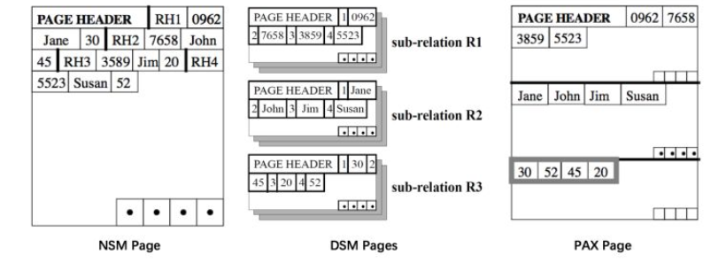

# 列式存储综述

> 列式存储的优势一方面体现在存储上能节约空间，减少IO，另一方面依靠列式数据结构做了计算上的优化。

## 主要内容

1. 列式存储的数据组织方式
   1. 数据的布局
   2. 数据的编码
   3. 数据的压缩

## OLTP VS OLAP

数据处理大致可以分成两大类：联机事务处理 OLTP（on-line transaction processing）、联机分析处理 OLAP（On-Line Analytical Processing）。OLTP是传统的关系型数据库的主要应用，主要是基本的、日常的事务处理，例如银行交易。OLAP是数据仓库系统的主要应用，支持复杂的分析操作，侧重决策支持，并且提供直观易懂的查询结果。 

**OLTP** 系统强调数据库内存效率，强调内存各种指标的命令率，强调绑定变量，强调并发操作；
**OLAP** 系统则强调数据分析，强调SQL执行市场，强调磁盘I/O，强调分区等。 

**HTAP** 混合OLTP和OLAP业务同时处理的系统。 它支持更多的信息和“实时业务”的决策。

|            |          OLTP          |               OLAP               |
| :--------: | :--------------------: | :------------------------------: |
|  应用场景  |  以实体为单位进行CRUD  | 遍历表进行分组，排序，聚合等操作 |
|    用户    | 操作人员，底层管理人员 |      决策人员，高级管理人员      |
|    功能    |      日常操作处理      |             分析决策             |
| 数据库设计 |   面向应用，行式存储   |        面向主题，列式存储        |
|   用户数   |         上千个         |             上百万个             |
|  主要应用  |         数据库         |             数据仓库             |

## 什么是列式存储

传统的OLTP数据块通常采用**行式存储**：所有列一次构成一行，以行为单位存储，再配B+树或SS-Table作为索引，能够快速通过主键找到相应的行数据。在物理存储方面，一行数据存在物理上相邻的位置。

## 起源: DSM 分页模式

由于机械磁盘受限于磁头寻址过程，读写通常都以一块（block）为单位，**故在操作系统中被抽象为块设备**，与流设备相对。这能帮助上层应用是更好地管理储存空间、增加读写效率等。这一特性直接影响了数据库储存格式的设计：数据库的 Page 对应一个或几个物理扇区，让数据库的 Page 和扇区对齐，提升读写效率。

那如何将数据存放到页上呢？

大多数服务于在线查询的 DBMS 采用 **NSM (N-ary Storage Model)** 即按行存储的方式，将完整的行从 Header 开始依次存放。页的最后有一个索引，存放了页内各行的起始偏移量。

NSM 的缺点在于，如果每次查询只涉及很小的一部分列，那多余的列依然要占用掉宝贵的内存以及 CPU Cache，从而导致更多的 IO；为了避免这一问题，很多分析型数据库采用 **DSM (Decomposition Storage Model)** 即按列分页：将 关系按列拆分成多个子集。类似的，页的尾部存放了一个索引。

而**PAX (Partition Attributes Cross)**的做法是将一个页划分成多个 minipage，minipage 内按列存储，而一页中的各个 minipage 能组合成完整的若干 relation。

## 列式存储的数据压缩

列式存储可以有很高的压缩比。

